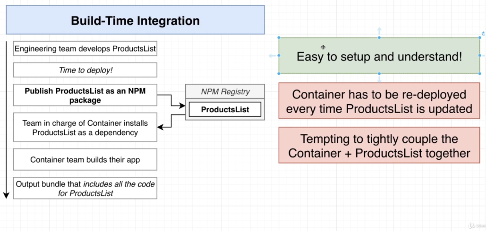

# ZTM_MIcrofrontend_with_React-A_Complete_Developers_Guide
Repo to hold the course work

# Microfrontend

1. Divide a monolithic app into multiple, smaller apps
2. Each smaller app is responsible for a distinct feature of the product

# Why use Microfrontend?

1. Multiple engineering teams can work together in isolation
2. Each smaller app is easier to understand and make changes to 

# Intergration in Microfrontend

1. There is no single perfect solution to integration
2. Many Solutions, eacha have pros and cons 
3. Look at what your requirements are , then pick a solution

# Major Categories of Intergration

1. Build-Time Integration (Compile-Time Integration)  
  Before Container gets loaded in browser, it get access to ProductsList source code

2. Run-Time Integration (Clien-Side Integration)  
  After Container gets loaded in browser, it get access to ProductsList source code

3. Server Integration  
  While sending down JS to load up Container, a server decides on whether or not to 
include ProductsList source

# Integration in our Course

# Webpack CLI version update - Class constructor ServeCommand error

In the upcoming lecture, we will be installing our dependencies. We will need to install a slightly different version of **webpack-cli** and **html-webpack-plugin** to avoid some errors:

`npm install webpack@5.4.0 webpack-cli@4.5.0 webpack-dev-server@3.11.0 faker@5.1.0 html-webpack-plugin@5.1.0`

If you have already installed an older version and get an error like this:

*Class constructor ServeCommand cannot be invoked without 'new'*

or

*TypeError: cli.isValidationError is not a function*

You will need to update the webpack-cli and html-webpack-plugin versions in your package.json:

    "webpack-cli": "^4.5.0",

    "html-webpack-plugin": "^5.1.0",

Then, delete your node_modules and package-lock.json files and run a new `npm install`